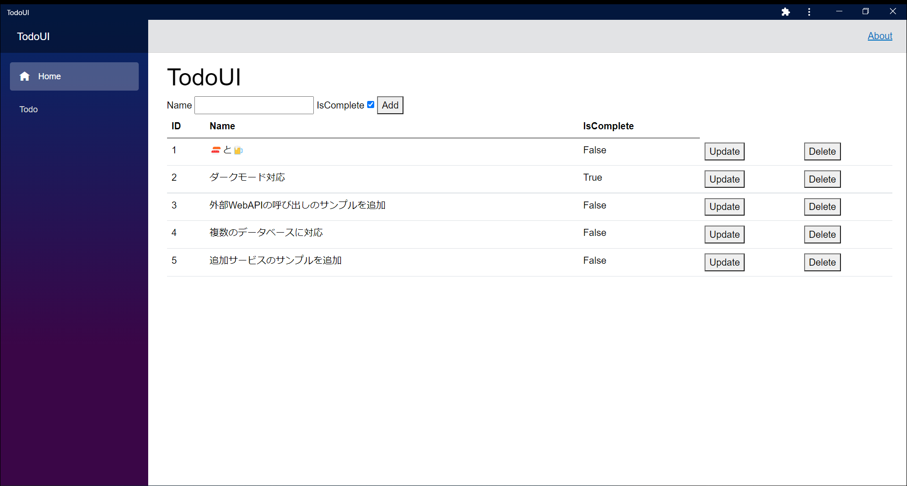
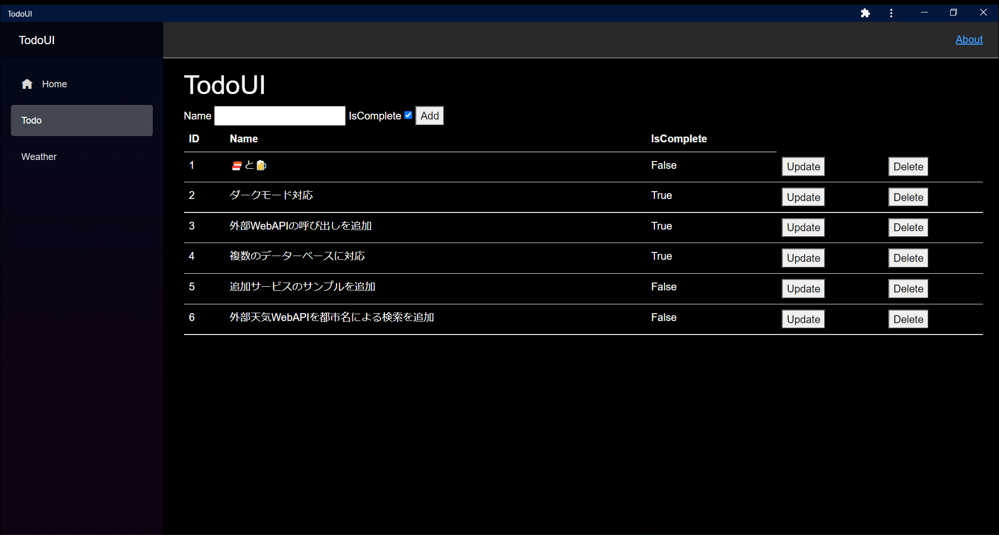
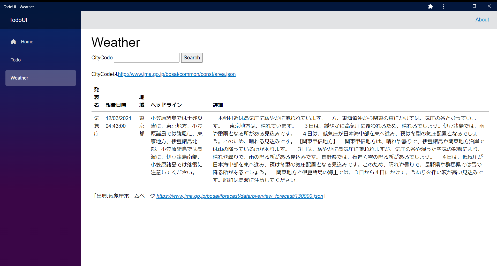
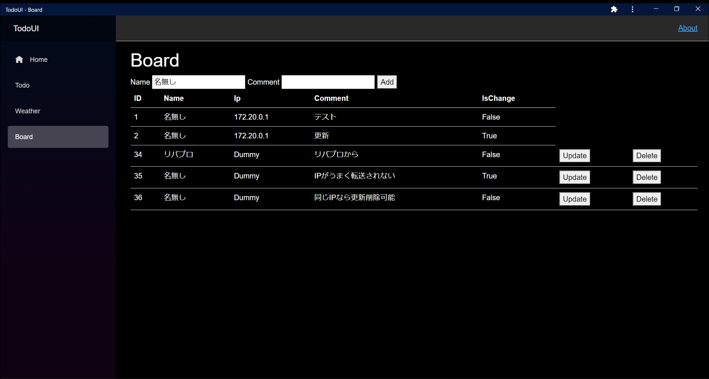
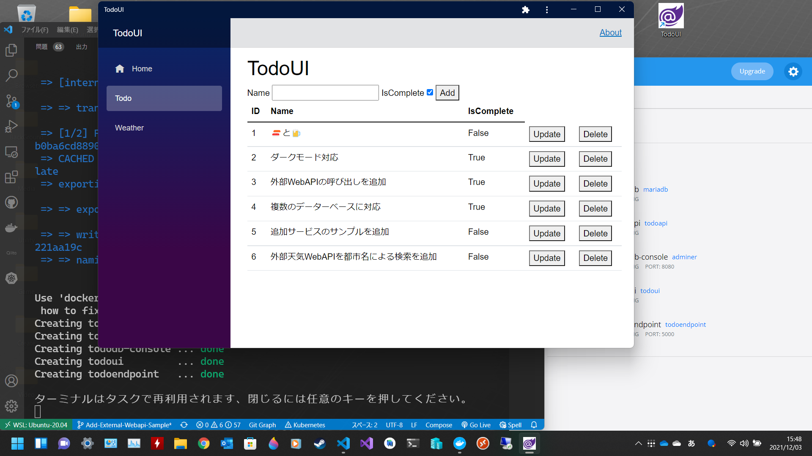

# TodoApp For Microservices

This project is a todo application that uses a microservice architecture.

It was created for learning microservice architecture.

The base minimum configuration is [v1.x.x Version Line](https://github.com/Yutaro-B18016/TodoApp-For-Microservices/tree/v1.x.x-Minimum-Configuration).

Additional microservices and external WebAPI examples are in [v2.x.x Version Line](https://github.com/Yutaro-B18016/TodoApp-For-Microservices/tree/master).









## Structure

|                    Name                    |       Type        | Languages | Environment |   OS   |          Framework           | Description                                       |   Dependences   |
| :----------------------------------------: | :---------------: | :-------: | :---------: | :----: | :--------------------------: | ------------------------------------------------- | :-------------: |
|                  TodoApi                   |      WebAPI       |    C#     |   .NET 6    | alpine |    ASP.NET Core 6 WebAPI     | CRUD WebAPI For Todo.                             |     TodoDB      |
|                   TodoUI                   |       WebUI       |    C#     |   .NET 6    | alpine | ASP.NET Core 6 Blazor Server | WebUI For TodoApi. PWA Support. Dark-Mode Support |     TodoApi     |
|                TodoEndpoint                | External Endpoint |   ----    |    Nginx    | alpine |             ----             | Nginx Reverse Proxy/TodoApp Endpoint.             |     TodoUI      |
|                   TodoDB                   |        DB         |   ----    |   MariaDB   | ubuntu |             ----             | DB For TodoApi.                                   |      ----       |
| TodoDB-Console(BoardDB-Console) (Optional) | DB UI (Optional)  |   ----    |   adminer   | alpine |             ----             | TodoDB(BoardDB) Optional UI                       | TodoDB(BoardDB) |

### Additional Microservices/External WebAPI Sample

|      Name       |  Type  | Languages  | Environment |   OS   | Framework | Description                                                        | Dependences |
| :-------------: | :----: | :--------: | :---------: | :----: | :-------: | ------------------------------------------------------------------ | :---------: |
|    WeaterApi    | WebAPI |    ----    |    ----     |  ----  |   ----    | External WebAPI Sample                                             |    ----     |
|    BoardApi     | WebAPI | TypeScript |   Node.js   | alpine |  NestJS   | Additional Microservices WebAPI Sample                             |   BoardDB   |
|     BoardDB     |   DB   |    ----    | PostgreSQL  | alpine |   ----    | DB For BoardApi.                                                   |    ----     |
| clientIPAddrApi | WebAPI |    ----    |    ----     |  ----  |   ----    | Get Client IP Address For TodoUI Board using JavaScript Injection. |    ----     |

### Access Flow


## Deployment

### Docker

Requirements

- Docker
- Docker Compose (If you have less than Compose V2, use the `docker-compose` command instead of the `docker compose` command.)

```bash
git clone git@github.com:Yutaro-B18016/TodoApp-For-Microservices.git

cd TodoApp-For-Microservices/deploy/compose

docker compose up -d --build
```

After deployment, it can be accessed on `localhost:5000`.

You can use Adminer on `localhost:8080` to access the DB.(The default is tododb for Server, todoapi for user, toadoapi for password, and todoapi for database.)

### Kubernetes

Requirements

- kubectl (Able to manipulate target Kubernetes)
- Docker
- skaffold

```bash
git clone git@github.com:Yutaro-B18016/TodoApp-For-Microservices.git

cd TodoApp-For-Microservices/

SKAFFOLD_DEFAULT_REPO=$DOCKER_REGISTRY skaffold -n $DEPLOY_NAMESPACE run
```

**$DOCKER_REGISTRY needs to be changed to your Docker Registry, and $DEPLOY_NAMESPACE to your deploy namespace.**

If you use the default namespace, `-n $DEPLOY_NAMESPACE` is optional.

If you are using a local Docker Registry such as Minikube, `SKAFFOLD_DEFAULT_REPO=$DOCKER_REGISTRY` is not necessary.

After deployment, it can be accessed on `Node IP:31000` using the node port.

The data in the DB is not persistent.

#### Sample NS/SC/PV/PVC (Use the sample to make the data persistent.)

The sample PV uses Node local.(It is not possible to increase the value of `replicas` in the database.)

**The node-name in [Todo-SC.yml](./deploy/k8s/Todo-SC.yml) needs to be changed to your node name.**

```bash
git clone git@github.com:Yutaro-B18016/TodoApp-For-Microservices.git

cd TodoApp-For-Microservices/deploy/k8s/

kubectl apply -f Todo-NS.yml

sudo mkdir -p /mnt/kubernetes/tododb

sudo chmod 777 /mnt/kubernetes/tododb

kubectl apply -f Todo-SC.yml

cd ../../

SKAFFOLD_DEFAULT_REPO=$DOCKER_REGISTRY skaffold -n todoapp run

cd ./deploy/k8s/

kubectl apply -n todoapp -f TodoDB-PVC.yml

kubectl apply -n todoapp -f BoardDB-PVC.yml
```

#### Access using Ingress

**The default Ingress Controller is required.**

After deploying the app, do the following.

```bash
git clone git@github.com:Yutaro-B18016/TodoApp-For-Microservices.git

cd TodoApp-For-Microservices/deploy/k8s/

kubectl apply -n $DEPLOY_NAMESPACE -f Tododb-Ingress.yml
```

After deployment, it can be accessed by Ingress.

#### Accessing the DB using Adminer

```bash
git clone git@github.com:Yutaro-B18016/TodoApp-For-Microservices.git

cd TodoApp-For-Microservices/deploy/k8s/

kubectl apply -n $DEPLOY_NAMESPACE -f Tododb-Console.yml
```

After deployment, it can be accessed on `Node IP:31880` using the node port.(The default is tododb or boarddb for Server, todoapi or boardapi for user, toadoapi or boardapi for password, and todoapi or boardapi for database.)

## Development

Requirements

- Docker
- Docker Compose
- Visual Studio Code
- Remote - Containers (VSCode Extentions)
- Docker (VSCode Extentions)



### TodoApi/TodoUI/BoardApi

Open the [TodoApi](./TodoApi/)/[TodoUI](./TodoUI) directory in VSCode.

After opening, select `Reopen in Container` in the notification at the bottom right.

### DEV Container

|   Name   |   OS   |      Tag      |                                           Description                                           | Dependences |
| :------: | :----: | :-----------: | :---------------------------------------------------------------------------------------------: | :---------: |
| TodoApi  | Debian | bullseye-slim | In order to support Omni Sharp within C# extensions, the development environment must be glibc. |   TodoDB    |
|  TodoUI  | Debian | bullseye-slim | In order to support Omni Sharp within C# extensions, the development environment must be glibc. |   TodoApi   |
| BoardApi | alpine |  lts-alpine   |                                           node image                                            |  BoardApi   |

## Configure

### TodoApi

|              ENV              |                              Default Value                               |            Type             |                                                    Description                                                     | Enable/Disable |
| :---------------------------: | :----------------------------------------------------------------------: | :-------------------------: | :----------------------------------------------------------------------------------------------------------------: | :------------: |
|             urls              |                              http://*:5000                               |      Internal Endpoint      |                                                  TodoApi Endpoint                                                  |     Enable     |
|           Provider            |                                  MySQL                                   |         DB Provider         |                           Select DB Provider InMemory/MySQL/PostgreSQL/SQLServer/SQLite                            |     Enable     |
|   ConnectionStrings__MySQL    |      Server=tododb;Database=todoapi;User=todoapi;Password=todoapi;       |    DB ConnectionStrings     |                              TodoDB Connection Information When The Provider is MySQL                              |     Enable     |
| ConnectionStrings__PostgreSQL | Host=tododb;Port=5432;User Id=todoapi;Password=todoapi;Database=todoapi; |    DB ConnectionStrings     |                              TodoDB Connection Information The Provider is PostgreSQL                              |     Enable     |
| ConnectionStrings__SQLServer  |       Server=tododb;Database=todoapi;User Id=sa;Password=Xt0d0ap!;       |    DB ConnectionStrings     |                            TodoDB Connection Information When The Provider is SQLServer                            |     Enable     |
|   ConnectionStrings__SQLite   |                          Filename=DB/todoapi.db                          | DB Data storage destination | DB Data storage destination information When The Provider is SQLite. The destination directory must already exist. |     Enable     |

#### GET/POST

- /api/todoitems

#### PUT/DELETE

- /api/todoitems/${id}

#### Request Header

- Content-Type: application/json

#### Type

- json

##### Json example

```json
{
    "id": 1, //long Type //Except POST
    "name": "Walking", //string nullable Type
    "isComplete": true //bool type
}
```

### TodoUI

|   ENV    |            Default Value            |       Type        |   Description   | Enable/Disable |
| :------: | :---------------------------------: | :---------------: | :-------------: | :------------: |
|   urls   |            http://*:5000            | Internal Endpoint | TodoUI Endpoint |     Enable     |
| todoapi  |  http://todoapi:5000/api/todoitems  |        URL        |   TodoApi URL   |     Enable     |
| boardapi | http://boardapi:3000/api/boarditems |        URL        |  BoardApi URL   |     Enable     |

- PWA Support (Except offline, `https` configuration required except localhost)
- Dark-Mode Support (Depends on device settings)

#### Mapping

- / -> TodoApi
- /todo -> TodoApi
- /weather -> External Weather WebAPI
- /board -> BoardApi

### TodoEndpoint

|     ENV      |            Default Value            |  Type   |   Description    | Enable/Disable |
| :----------: | :---------------------------------: | :-----: | :--------------: | :------------: |
|    todoui    |         http://todoui:5000          |   URL   |    TodoUI URL    |     Enable     |
|  todoui_map  |                  /                  | Mapping |  TodoUI Mapping  |     Enable     |
|   todoapi    |  http://todoapi:5000/api/todoitems  |   URL   |   TodoApi URL    |    Disable     |
| todoapi_map  |           /api/todoitems            | Mapping | TodoApi Mapping  |    Disable     |
|   boardapi   | http://boardapi:3000/api/boarditems |   URL   |   BoardApi URL   |    Disable     |
| boardapi_map |           /api/boarditems           | Mapping | BoardApi Mapping |    Disable     |

If you want to expose the TodoApi to the External, you will need to change [default.conf.template](./TodoEndpoint/default.conf.template) and set the environment variables(`todoapi` and `todoapi_map`, `boardapi` and `boardapi_map`).

### TodoDB

|         ENV         | Default Value |    Type     |     Description      | Enable/Disable |
| :-----------------: | :-----------: | :---------: | :------------------: | :------------: |
| MYSQL_ROOT_PASSWORD |    todoapi    | DB Password | TodoDB Root Password |     Enable     |
|   MYSQL_DATABASE    |    todoapi    |   DB Name   |     TodoDB Name      |     Enable     |
|     MYSQL_USER      |    todoapi    |   DB USER   |     TodoDB USER      |     Enable     |
|   MYSQL_PASSWORD    |    todoapi    | DB Password |   TodoDB Password    |     Enable     |

### TodoDB-Console(BoardDB-Console) (Optional)

|          ENV           |  Default Value  |       Type        |       Description        | Enable/Disable |
| :--------------------: | :-------------: | :---------------: | :----------------------: | :------------: |
| ADMINER_DEFAULT_SERVER | tododb(boarddb) | Internal Endpoint | TodoDB(BoardDB) Endpoint |     Enable     |

### WeaterApi(External WebAPI Sample)

#### WebAPI Json URL Format

- https://www.jma.go.jp/bosai/forecast/data/overview_forecast/${ID}.json

#### GET ID Json URL

- http://www.jma.go.jp/bosai/common/const/area.json

ex)
https://www.jma.go.jp/bosai/forecast/data/overview_forecast/130000.json

##### Json example

```json
{
    "publishingOffice": "気象庁", //String Type
    "reportDatetime": "2021-12-14T16:36:00+09:00", //Date Type
    "targetArea": "Area", //String Type
    "headlineText": "", //String Type
    "text": "String" //String Type
}
```

<q><cite>出典:気象庁ホームページ https://www.jma.go.jp/bosai/forecast/data/overview_forecast/130000.json</cite></q>

### BoardApi

|         ENV         |     Default Value      |          Type           |                                     Description                                      | Enable/Disable |
| :-----------------: | :--------------------: | :---------------------: | :----------------------------------------------------------------------------------: | :------------: |
| TYPEORM_CONNECTION  |        postgres        |       DB Provider       |    Select DB Provider postgres/mysql(/mariadb)/sqlite/mssql/oracle/mongodb/sqljs     |     Enable     |
|    TYPEORM_HOST     |        boarddb         |       DB HostName       |                              BoardDB DNS or IP Address                               |     Enable     |
|  TYPEORM_USERNAME   |        boardapi        |      DB User Name       |                                  BoardDB User Name                                   |     Enable     |
|  TYPEORM_PASSWORD   |        boardapi        |       DB Password       |                                   BoardDB Password                                   |     Enable     |
|  TYPEORM_DATABASE   |        boardapi        |         DB Name         | BoardDB DB Name/DB Data storage destination information When The Provider is SQLite. |     Enable     |
|    TYPEORM_PORT     |          5432          |     DB Port Number      |                                 BoardDB Port Number                                  |     Enable     |
| TYPEORM_SYNCHRONIZE |          true          | DB Migration at Startup |                             BoardDB Migration at Startup                             |     Enable     |
|   TYPEORM_LOGGING   |         false          |    DB Logging on API    |                                False for Performance                                 |     Enable     |
|  TYPEORM_ENTITIES   |  dist/**/*.entity.js   |     Entity JS file      |                                  No Need to Change                                   |     Enable     |
| TYPEORM_MIGRATIONS  | dist/migration/**/*.js |  DB Migration JS file   |                                  No Need to Change                                   |     Enable     |

#### GET/POST

- /api/boarditems

#### PUT/DELETE

- /api/boarditems/${id}

#### Request Header

- Content-Type: application/json

#### Type

- json

##### Json example

```json
{
    "id": 1, //long(number) Type //Except POST
    "name": "YMD", //string Type
    "ip": "192.0.0.1", //string Type
    "comment": "Test", //string Type
    "date": "2021-12-10T05:34:41.275Z", //DateTimeOffset(Date) Type //Defaults to the date you posted. //Automatic Setting //Cannot be changed by user
    "isChange": true //boolean type //Default false //Update true //Automatic Setting //Cannot be changed by user
}
```

### BoardDB

|        ENV        | Default Value |    Type     |      Description      | Enable/Disable |
| :---------------: | :-----------: | :---------: | :-------------------: | :------------: |
|   POSTGRES_USER   |   boardapi    |   DB USER   |     BoardDB USER      |     Enable     |
| POSTGRES_PASSWORD |   boardapi    | DB Password |   BoardDB Password    |     Enable     |
|    PGPASSWORD     |   boardapi    | DB Password | BoardDB Root Password |     Enable     |
|    POSTGRES_DB    |   boardapi    |   DB Name   |     BoardDB Name      |     Enable     |

### clientIPAddrApi(External WebAPI Sample)

#### WebAPI Json URL

- https://jsonip.com/

##### Json example

```json
{
    "ip": "Your IP", //string Type
    "geo-ip": "https://getjsonip.com/#plus", //string Type
    "API Help": "https://getjsonip.com/#docs" //string Type
}
```